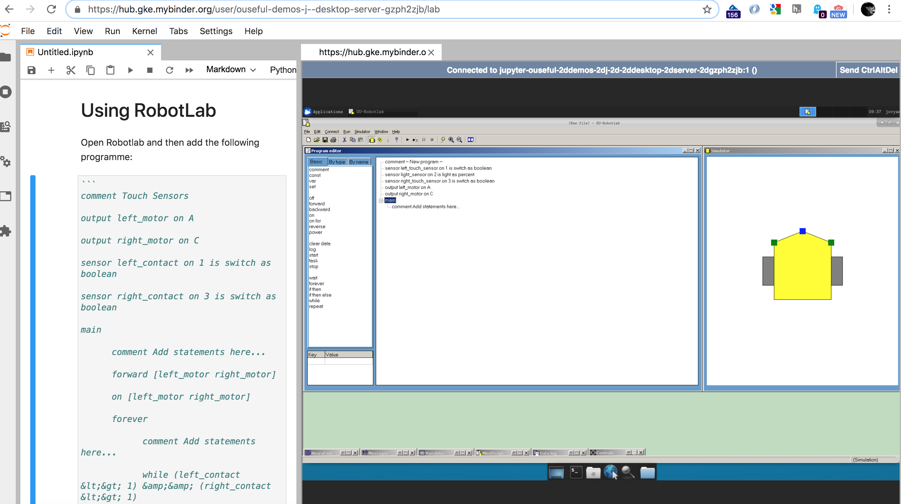

# Jupyter Desktop Server + Wine

Launch into desktop: 

Launch into JupyterLab: 

Launch into notebook: 

Run XFCE (or other desktop environments) on a JupyterHub; demo includes running a Windows desktop application under Wine.

JupyterLab:

The display is quite a high resolution to start with; this can be fixed during a user session from the desktop `Applications > Settings > Display` menu. Presumably, there is a way of setting a config file to constrain this at boot time?

Jupyter Notebook:

At the moment, the demo requires:

- you grab the desktop URL;
- In JupyterLab, in the IFrame extension option buried in one of the impossible to navigate JupyterLab sidebar menus, open an iframe using the desktop URL; reshape the window to sit alongside a notebook;
- In Jupyter notebook, `from IPython.display import IFrame; IFrame(src=DESKTOP_URL, width='100%', height=600)`

This is based on https://github.com/yuvipanda/jupyter-desktop-server, which was itself based on https://github.com/ryanlovett/nbnovnc and a fork of https://github.com/manics/jupyter-omeroanalysis-desktop

The main contribution from this repo is the demo Dockerfile.

## To Do

Lots... Initial proof of concept only.

- tidy things up; better install, get rid of build clutter in final container;
- current demo is to manually copy the desktop link and then use it as an iframe URL in either notebook (via `IPython.display.IFrame` or in JupyterLab using https://github.com/timkpaine/jupyterlab_iframe;
- `jupyterlab_iframe` docs suggest various settings for `jupyter_notebook_config.py`, such as `c.JupyterLabIFrame.iframes = [url]` to list sites and `c.JupyterLabIFrame.welcome = url` as a default opening page when JupyterLab is opened;
- Jupyter notebook demo can be improved with a simple extension that loads the site into an iframe then pops that into a floating JQuery dialogue;
- it would be handy if jupyter-server-proxy could be configured in JupyterLab as a launcher button that opens the desktop into an inframe window;
- it would be handy if the desktop server proxy URL were available eg via an environment variable accessible to Python shell (it may already be? Not checked.)
- does the supported desktop allow you to launch and focus on a single application, so eg rather than view the whole desktop, we just see a specified application window;
- for current OU-RobotLab demo, need to tidy up desktop icons etc;
- do a simple notebook to demo example teaching material that might sit alongsise the application and guide an activity based around it;
- is there a way to drive the application from Pyhton that is reflected by the applciation view on the desktop?
- could we do a selenium demo that automates a browser based activity rendered on the desktop through Firefox running on the desktop? This would be one way of doing "live demos"? Cf. Jupyter Graffiti.
